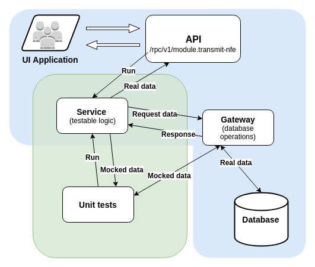

## Criação/configuração de serviços e endpoints

## Serviços

#### Serviços Getters
- Getters apenas retornam dados com filtros ou não
- Não devem conter lógica
- Requisições no banco são diretos pela classe

#### Serviços com lógica de negócio
- Cada serviço deve ter apenas uma responsabilidade (princípios SOLID);
- Devem ter funções de execução mais rápida possível;
- Funções que retornam resultados para a API devem sempre retornar array;
- Inversão de dependência (service manager);
- Evitar abstrações, serviços não podem ser dependentes de classes pais pois podem criar obstruções para uma refatoração futura;
- Toda função com lógica deve ser desenvolvida e testada usando [TDD](./ServiceUnitTest);
- Praticar boas práticas de programação (Clean Code, PSRs, etc);
- Todo serviço deve ter seu gateway correspondente para requisições que dependem do banco de dados ou requisições externas (integrações);
- Arquivo para registrar serviços (`module.config.php` - correspondente ao modulo da classe):
```php
    'service_manager' => [
        'factories' => [
            \Application\Service\Sale::class =>  [\Application\Service\Sale::class, 'factory'],
        ]
    ]
```

#### Inversão de Dependências:

- O serviço só pode ser instanciado por meio do Service Manager, exceto em testes unitários;
- Factories devem ser funções estáticas;
- Sempre que o serviço tiver dependência de um serviço externo ele deve ser passado para a factory e não instanciado dentro da classe;
- O mesmo é válido para dados de configurações, gateways, entidades, cliente logado, etc;
- A factory é executada toda vez que o namespace do serviço é chamado no service mananger (ServiceLocator);
- Exemplo de factory em uma classe:
```php

namespace Application\Service;

/**
 * @author Developer Name <email@clippfacil.com.br>
 */
class Service
{
    private $gateway;
    private $client;
    private $externalService;

    public static function factory($serviceLocator)
    {
        return new self(
            $serviceLocator->get('CurrentClient'),
            new ProductGateway($serviceLocator->get('EntityManager')),
            $serviceLocator->get(\Application\Service\ExternalService::class)
        );
    }

    public function __construct($client, $gateway, $externalService)
    {
        $this->client = $client;
        $this->gateway = $gateway;
        $this->externalService = $externalService;
    }
}
```

## Endpoints
- Endpoints públicos/autenticados devem ser estáticos, abstratos e não podem alterar o formato da resposta;
- Endpoints feitos para fins muitos específicos devem ser evitados
- Endpoints podem ser acessíveis apenas para planos específicos (ACL);
- Arquivo para registrar endpoints (`service.config.php` - correspondente ao modulo da classe):

```php
    'send-product' => [
        'class' => \Application\Service\Product::class,
        'method' => 'metodoDoServico',
        'authorization' => true,
        'description' => 'descrição do endpoint em inglês',
        'parameters' => [
            [
                'name' => 'ids',
                'required' => true,
                'description' => 'descrição do parâmetro em inglês',
            ],
        ]
    ]
```

#### Floxugrama de um serviço com gateway e o funcionamento com testes unitários



## Integrações
- Se a integração trabalha com um fluxo frequente de dados e requisições o recomendável é usar filas ([Doc aqui](./Filas));
- Requisições remotas devem estar dentro de gateways;
- Dados de configurações, tokens, urls, etc deve ser setados no arquivo `module.config.php`;
- Lógica deve ser desenvolvida de modo que as classes de integrações devem ser pensadas como classes substituíveis;

## Complementação
- [Repositórios do doctrine e gateways](RepositoriesAndGateways.md)
- [Boas práticas](./GoodPractices)
- [Exceptions](./Exceptions)
- [Mensagens de erro](./ErrorMessages)
- [Code Review](../Checklist)
