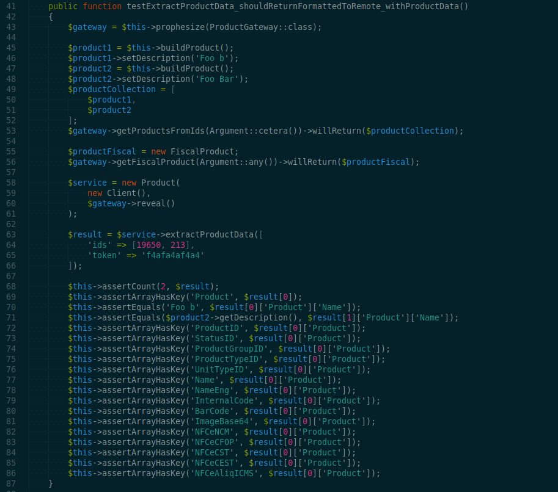
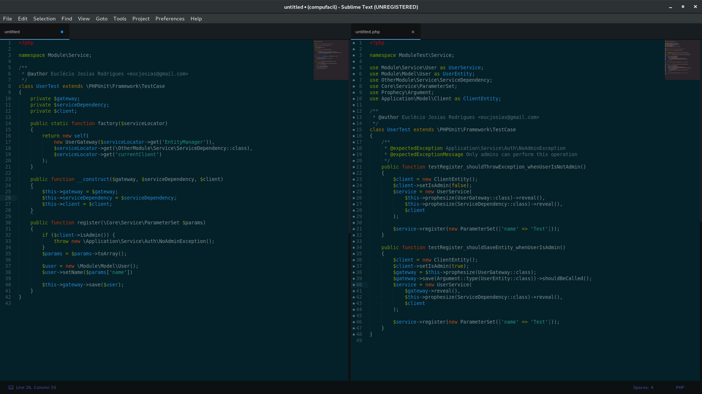
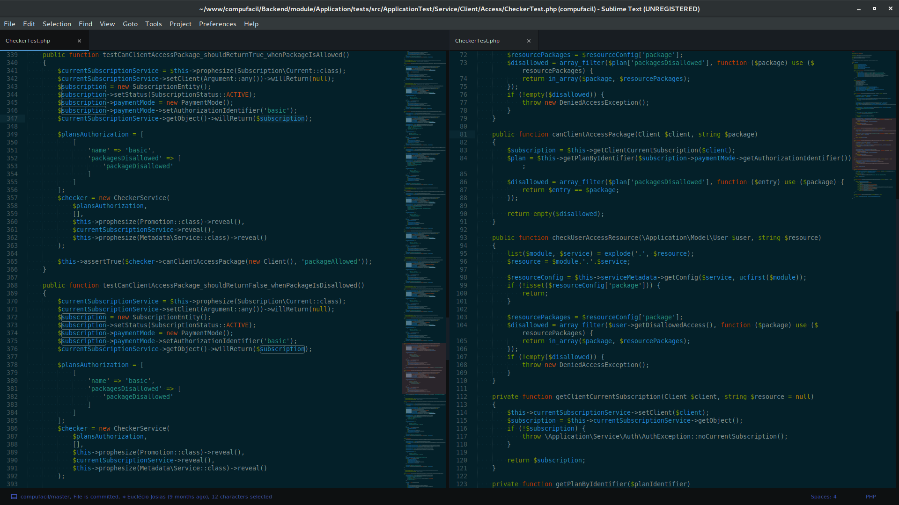

## Testes Unitários (PHPUnit)

- A função dos testes unitários é validar se a lógica do serviço está funcionando como esperado
- Toda classe de teste deve ter o nome do serviço correspondente testado com o sufixo 'Test';
- Cada serviço tem sua classe de teste;
- A preferência é que sejam feitos antes do desenvolvimento do serviço;
- Devem testar a lógica de negócio da classe;
- Devem ser curtos e objetivos;
- Os dados e operações no banc;o devem ser mocks (gateways);
- O nome do teste deve ser semântico;
- O que está sendo testado/o que deve acontecer/em qual situação;
- Logo, a nomenclatura de funções devem seguir o padrão `testFunctionName_shouldDoThis_whenThisSituation` (ex.: `testSendProducts_ShouldThrowsException_WhenRemoteServerIsOut`)
- Cada função de teste deve validar somente aquilo que sua nomenclatura diz fazer;
- Para cada bug encontrado e corrigido deve-se criar um teste unitário para evitar novas ocorrências;
- Utilize outras classes como base para criar novos;
- Testes com a flag `@group oldTestStack` estão depreciados;

### Especificações mais detalhadas: [veja aqui](./UnitTests)

#### Mock de dados

O mock de dados são dos fictícios utilizados no lugar dos dados reais das funções. Eles servem para simular situações, eventos e dados que irão validar a lógica e o  resultado no formato esperado.

Exemplos usando o prophesize para fazer o mock de dados:
- [Documentação do prophesize](https://github.com/phpspec/prophecy)

#### Traits / Helpers
As Traits (helpers que auxiliam mock de dados e serviços) devem ser incluídas nas primeiras linhas da classe. Estes trechos de códigos são incluídos utilizando o `use`.
```php
    class ProductTest extends \CoreTest\TestCase
    {
        use \ApplicationTest\Helper\Entity;
    }
```

#### Exemplos usando os Helpers do sistema:
```php
$product1 = $this->buildProduct();
$product2 = $this->buildProduct();
$product1->setName('Foo Bar');

$client = new \Application\Model\Client();
$client->setActive(false);
```

#### To access CI build that run unit tests
```sh
cpf-ssh.sh --unittests
```

### Exemplos de testes unitários





## Complementação
[Checklist](../Checklist)
